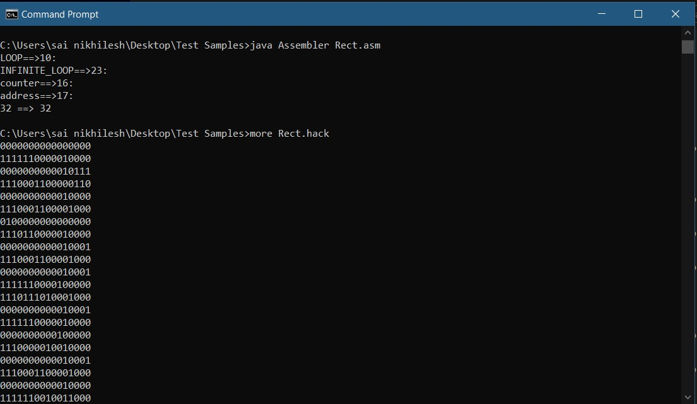
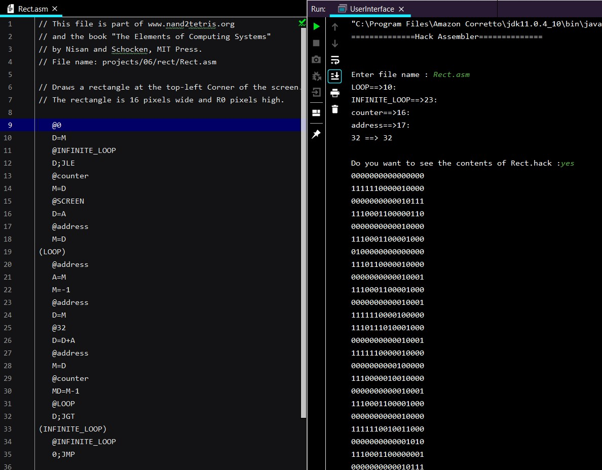
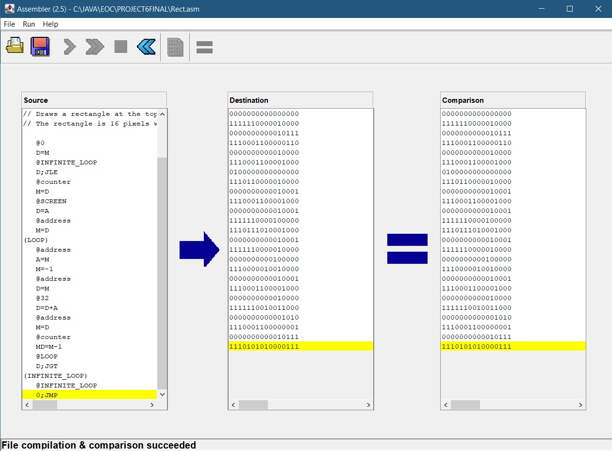

# AssemblyCodeToBinaryCode (Hack)

## Description of program
### BACKGROUND:-
Low-level machine programs are rarely written by humans. Typically, they are generated by compilers. Yet humans can inspect the translated code and learn important lessons about how to write their high-level programs better, in a way that avoids low-level pitfalls and exploits the underlying hardware better. One of the key players in this translation process is the assembler -- a program designed to translate code written in a symbolic machine language into code written in binary machine language.

it deals with building the first rung up the software hierarchy, which will eventually end up in the construction of a compiler for a Java-like high-level language. But, first things first.


### OBJECTIVE:-
Write an Assembler program that translates programs written in the symbolic Hack assembly language into binary code that can execute on the Hack hardware platform

## Getting Started

These instructions will get you a copy of the project up and running on your local machine for development and testing purposes. See deployment for notes on how to deploy the project on a live system.

## Prerequisites

Java JDK (Oracle JDK) should be installed in your system to compile and the files.

## Running the tests

### Usage
Depending on the programming language that you use, the assembler should be invoked using something like "Assembler fileName.asm", where the string fileName.asm is the assembler's input, i.e. the name of a text file containing Hack assembly commands. The assembler creates an output text file named fileName.hack. Each line in the output file consists of sixteen 0 and 1 characters. The output file is stored in the same directory of the input file. The name of the input file may contain a file path. (or we can run this in interactive mode by using “java UserInterface”)

PROJECT6FINAL - Direct Project for Intellij idea.

Test Samples  - For quick Prototyping (using cmd). 

### Output of the tests

#### Using direct usage of "java Assembler Rect.asm" :


#### Using direct usage of "java UserInterface" :


### Verification using Emulator(Nand2Tetris-Tools)


## Built With

* [openjdk 11.0.4] (https://openjdk.java.net/)

## Acknowledgments

Shimon Schocken and Noam Nisan from
```
Nand2Tetris - Project 6: Assembler (https://www.nand2tetris.org/course)
```
## Achieved Goals

* All test cases provided by Nand2Tetris is working
* Hash Maps
* File Handling in depth
* Minor improvements 
